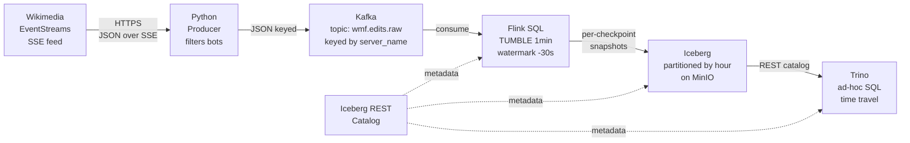

# streamscope

> Real-time engagement analytics pipeline on the Netflix data stack.
> **Kafka → Flink SQL → Iceberg → Trino**, ingesting live events from Wikimedia EventStreams with event-time windowing and end-to-end exactly-once semantics.

[](https://github.com/Gupta-Anit/streamscope/actions)

---

## What this is

A single-tenant **Data Mesh skeleton** built to demonstrate end-to-end stream processing on the modern lakehouse stack. The same architectural shape, scaled out, is what powers Netflix's Data Mesh.

- **Source:** [Wikimedia EventStreams](https://stream.wikimedia.org/v2/stream/recentchange) — every Wikipedia edit, globally, ~50 events/sec. Genuinely real-time. No simulation.
- **Computation:** 1-minute tumbling-window aggregates per wiki, with event-time semantics and 30-second bounded watermarks for late data.
- **Output:** Iceberg table on object storage, queryable from Trino with sub-second latency, including time-travel queries against historical snapshots.
- **Guarantees:** end-to-end exactly-once via Flink checkpoints committed as Iceberg snapshots.

---

## Architecture



Every layer is the lightest viable choice for an MVP that still represents production-shape:

| Layer | Choice | Why |
|---|---|---|
| Source | Wikimedia EventStreams (SSE) | Truly real-time, free, no auth, rich enough for sessionization/aggregation |
| Ingestion | Kafka (KRaft mode) | No Zookeeper; matches modern deployments |
| Stream processing | Flink SQL 1.18 | What Netflix Data Mesh uses; cleanest event-time semantics |
| Table format | Iceberg 1.5.2 | Built at Netflix; ACID, time travel, cross-engine compat |
| Object store | MinIO | S3-compatible local stand-in |
| Catalog | Iceberg REST Fixture | Lightweight; v2 would be JDBC-backed |
| Query engine | Trino | Netflix's self-serve SQL layer |

---

## Quick start

**Requirements:** Docker 20+ (or OrbStack), Python 3.12 (for tests only), ~4GB free RAM.

```bash
git clone https://github.com/Gupta-Anit/streamscope
cd streamscope

# Bring up the full stack: Kafka, MinIO, Iceberg REST, Flink (JM + TM), Trino, producer
docker compose up -d --build

# Wait ~60s for all services to be healthy
docker compose ps --all
```

After ~2 minutes (1-minute window + 30s late allowance + 30s checkpoint), data is in Iceberg. Submit the Flink streaming job (see the **Run it** section below for the exact procedure).

Query results:

```bash
docker compose exec trino trino --execute "
SELECT server_name, SUM(edit_count) AS edits
FROM iceberg.streamscope.wmf_agg
GROUP BY server_name
ORDER BY edits DESC LIMIT 10
"
```

Expected output (your numbers will vary):

```
"www.wikidata.org","1482"
"en.wikipedia.org","416"
"commons.wikimedia.org","159"
"fr.wikipedia.org","70"
"de.wikipedia.org","63"
```

---

## Web UIs

| Service | URL | Credentials |
|---|---|---|
| Flink Dashboard | http://localhost:8081 | none |
| Trino UI | http://localhost:8080 | admin / (no password) |
| MinIO Console | http://localhost:9001 | `minioadmin` / `minioadmin` |
| Iceberg REST `/v1/config` | http://localhost:8181/v1/config | none |

---

## Run it (full procedure)

The producer comes up automatically with `docker compose up -d --build`. The Flink streaming job has to be submitted once via the SQL client (it persists across container restarts of Flink as long as iceberg-rest's state survives).

1. **Bring everything up:**
   ```bash
   docker compose up -d --build
   ```

2. **Open the Flink SQL Client:**
   ```bash
   docker compose exec flink-jobmanager ./bin/sql-client.sh
   ```

3. **Paste the catalog registration + table DDL:**

   ```sql
   CREATE CATALOG iceberg_catalog WITH (
       'type' = 'iceberg',
       'catalog-impl' = 'org.apache.iceberg.rest.RESTCatalog',
       'uri' = 'http://iceberg-rest:8181',
       'warehouse' = 's3://streamscope/warehouse',
       'io-impl' = 'org.apache.iceberg.aws.s3.S3FileIO',
       's3.endpoint' = 'http://minio:9000',
       's3.path-style-access' = 'true',
       's3.region' = 'us-east-1',
       's3.access-key-id' = 'minioadmin',
       's3.secret-access-key' = 'minioadmin'
   );

   CREATE DATABASE IF NOT EXISTS iceberg_catalog.streamscope;

   CREATE TABLE wmf_raw (
       server_name STRING,
       title       STRING,
       `user`      STRING,
       type        STRING,
       bot         BOOLEAN,
       namespace   INT,
       `timestamp` BIGINT,
       meta        ROW<dt STRING, domain STRING>,
       event_time AS TO_TIMESTAMP_LTZ(`timestamp` * 1000, 3),
       WATERMARK FOR event_time AS event_time - INTERVAL '30' SECOND
   ) WITH (
       'connector' = 'kafka',
       'topic' = 'wmf.edits.raw',
       'properties.bootstrap.servers' = 'kafka:29092',
       'properties.group.id' = 'streamscope-flink',
       'scan.startup.mode' = 'latest-offset',
       'scan.watermark.idle-timeout' = '60s',
       'format' = 'json',
       'json.ignore-parse-errors' = 'true'
   );
   ```

4. **Create the sink table in Trino** (only needed once; Flink SQL doesn't support hidden partition transforms):
   ```bash
   docker compose exec trino trino --execute "
   CREATE TABLE iceberg.streamscope.wmf_agg (
       window_start TIMESTAMP(3),
       window_end   TIMESTAMP(3),
       server_name  VARCHAR,
       edit_count   BIGINT,
       unique_users BIGINT
   ) WITH (
       partitioning = ARRAY['hour(window_start)'],
       format = 'PARQUET'
   )
   "
   ```

5. **Submit the streaming INSERT** in the Flink SQL Client:
   ```sql
   INSERT INTO iceberg_catalog.streamscope.wmf_agg
   SELECT
       window_start,
       window_end,
       server_name,
       COUNT(*)               AS edit_count,
       COUNT(DISTINCT `user`) AS unique_users
   FROM TABLE(
       TUMBLE(TABLE wmf_raw, DESCRIPTOR(event_time), INTERVAL '1' MINUTE)
   )
   GROUP BY window_start, window_end, server_name;
   ```

You'll get a Job ID. The job runs forever. Open http://localhost:8081 to watch it.

---

## Design decisions

| Decision | Why | Trade-off |
|---|---|---|
| **JSON over Avro** | Faster to set up; no Schema Registry needed | ~3x more storage; no enforced schema evolution. Documented as v2 work. |
| **Flink SQL over DataStream API** | Matches Netflix's Streaming SQL surface; declarative; faster to write | Less control over custom state and ProcessFunctions |
| **In-memory Iceberg REST catalog** | Lightest setup for MVP | Catalog state lost on container restart (tables persist in MinIO, need re-registration). Production: JDBC-backed. |
| **Trino creates sink table, Flink writes** | Flink SQL parser doesn't support partition transforms (`hour(col)` etc.) | Demonstrates cross-engine Iceberg compatibility — a *feature*, not a bug |
| **30s watermark allowance** | Reasonable default for Wikimedia's stream | Larger value = lower drop rate but higher latency; production sets this from observed P99 lateness |
| **Hourly partitioning** | Matches query patterns (most filters are time-bounded) | Daily too coarse, minute too fine (file explosion). Sweet spot. |
| **Path-style S3 access** | MinIO requirement | Virtual-hosted-style is AWS-native but MinIO doesn't support it |
| **AWS env vars in Flink containers** | Iceberg sink's S3 client falls back to env vars when catalog props aren't picked up | Belt-and-suspenders with `s3.region` in CREATE CATALOG |

---

## Exactly-once: how it works here

Three components in concert:

1. **Replayable source.** Kafka offsets stored in Flink checkpoint state. On restart, source rewinds to the last checkpointed offset.
2. **Atomic checkpoints.** Every 30 seconds, Flink snapshots all operator state plus the source offset to MinIO atomically.
3. **Transactional sink.** Iceberg's `IcebergStreamWriter` buffers Parquet writes; the `IcebergFilesCommitter` only commits a snapshot when its checkpoint completes. If a TaskManager dies mid-window, any in-flight Iceberg write that didn't make it into a committed snapshot is discarded on recovery.

**Chaos test results** (see [`docs/chaos-test-results.txt`](docs/chaos-test-results.txt)):

I killed the TaskManager mid-stream. Flink recovered from the last successful checkpoint, replayed Kafka from the saved offset, and continued. Row counts after recovery confirmed no duplicates — no `(window, server_name)` pair appeared twice:

```
Before chaos:  1401 rows, 29 snapshots, latest window 16:03:00
After chaos:   1655 rows, 33 snapshots, latest window 16:10:00
Duplicate (window_start, server_name) pairs after recovery: 0
```

---

## What I'd change at scale

| Concern | Current | At scale |
|---|---|---|
| Throughput | ~50 events/sec | Higher Kafka partition count + proportional Flink parallelism; benchmark backpressure |
| Storage efficiency | JSON | Avro + Schema Registry; ~3x reduction + enforced schema evolution |
| Catalog durability | In-memory | JDBC-backed (Postgres) or AWS Glue / Tabular's hosted catalog |
| Small-file problem | None currently | Scheduled Iceberg `OPTIMIZE` (compaction) job in Airflow |
| Serving latency | Trino (~sub-second) | Druid or ClickHouse for sub-100ms dashboards at high QPS |
| Observability | Flink UI only | Prometheus scraping Flink REST metrics, Grafana dashboards for consumer lag, checkpoint duration, watermark progress |

---

## Repo structure

```
streamscope/
├── compose.yml                   # All services, one command up
├── README.md                     # This file
├── pytest.ini                    # Test config
├── .github/workflows/ci.yml      # Test on every push
├── producer/
│   ├── producer.py               # Wikimedia SSE → Kafka
│   ├── requirements.txt
│   └── Dockerfile
├── flink/
│   ├── Dockerfile                # Adds Iceberg + Kafka + Hadoop connectors
│   └── conf/flink-conf.yaml      # Checkpoint + S3 + cluster config
├── trino/
│   └── catalog/iceberg.properties
├── tests/
│   └── test_producer.py          # Filter logic tests
└── docs/
    └── chaos-test-results.txt    # Output from the exactly-once chaos test
```

---

## Lessons from the build

Nine production-style issues hit during setup. Each one is a real lesson:

1. **Flink Docker entrypoint rewrites `jobmanager.rpc.address` to the container hostname** unless `FLINK_PROPERTIES` is set. Caused TaskManager to try to connect to itself.
2. **Iceberg's Flink runtime imports Hadoop classes** even when not using HDFS. Needs `flink-shaded-hadoop` JAR on the classpath.
3. **AWS SDK region resolution** has a fallback chain (env var → system property → AWS profile → EC2 metadata). Inside Flink TaskManager, none were set; sink crashed in a loop until `AWS_REGION` env var was added.
4. **MinIO requires `s3.path-style-access=true`** in every S3 client. Virtual-hosted-style URLs fail DNS lookup on `bucket.minio`.
5. **Trino `.properties` files don't support inline comments.** Everything after `=` is the value — including `#` characters.
6. **Flink SQL `PARTITIONED BY` doesn't support transform functions** like `hour(col)`. Workaround: create the table in Trino, which does.
7. **Trino's `fs.native-s3.enabled` was renamed to `fs.s3.enabled`** in version 470+.
8. **Wikimedia EventStreams requires a descriptive `User-Agent` header** per their policy. Anonymous requests get 403'd.
9. **Bind-mounting a file into a Flink container fails** because the entrypoint uses `sed -i` which can't rename over a bind mount. Fix: bake config into the image via `COPY`.

---

## License

MIT
